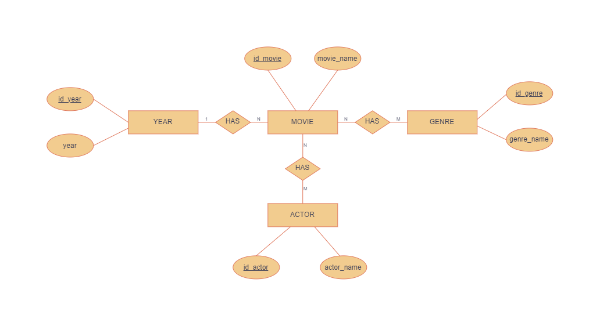
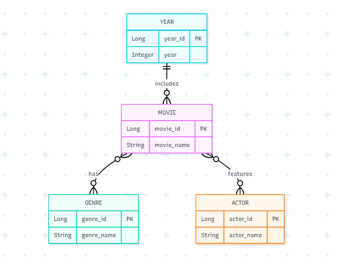
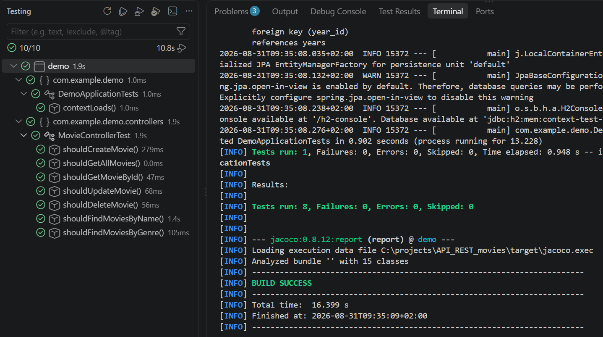
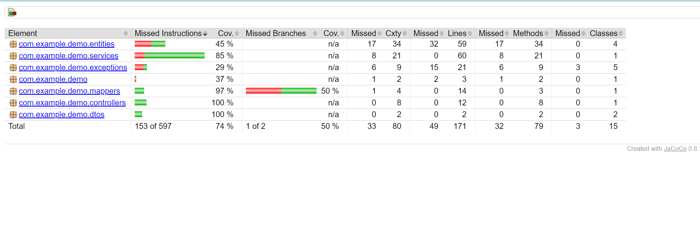

# Movies REST API

This project is a Spring Boot REST API for managing movies. It supports basic CRUD operations, searching movies by name or genre, and includes related tables for genres, release years, and actors.

## Technologies

- Java 21
- Spring Boot
- Spring Web MVC
- Spring Data JPA
- H2 Database
- Maven

## Data Model

The application uses the following main entities:

- `MovieEntity`
- `GenreEntity`
- `YearEntity`
- `ActorEntity`

Relationships:

- A movie has one release year.
- A release year can be assigned to many movies.
- A movie can have many genres, and a genre can belong to many movies.
- A movie can have many actors, and an actor can appear in many movies.

Database diagrams:





## How to Run

From the project root, run:

```bash
./mvnw spring-boot:run
```

On Windows:

```bash
.\mvnw.cmd spring-boot:run
```

The API will be available at:

```text
http://localhost:8080
```

## H2 Database

The project uses an H2 database stored locally in:

```text
./data/moviesdb
```

The H2 console is enabled at:

```text
http://localhost:8080/h2-console
```

Connection settings:

```text
JDBC URL: jdbc:h2:file:./data/moviesdb
Username: sa
Password:
```

Initial genres, years, and actors are inserted from `src/main/resources/data.sql`.

## API Endpoints

| Method | Endpoint | Description |
| --- | --- | --- |
| GET | `/movies` | Get all movies |
| GET | `/movies/{id}` | Get a movie by ID |
| POST | `/movies` | Create a new movie |
| PUT | `/movies/{id}` | Update an existing movie |
| DELETE | `/movies/{id}` | Delete a movie |
| GET | `/movies/name/{movieName}` | Search movies by name |
| GET | `/movies/genre/{genre}` | Search movies by genre |

## Request Body Example

Use this JSON format for `POST /movies` and `PUT /movies/{id}`:

```json
{
  "movieName": "Interstellar",
  "yearId": 1,
  "genreIds": [1, 2],
  "actorIds": [1, 2]
}
```

## Response Body Example

```json
{
  "id": 1,
  "movieName": "Interstellar",
  "year": 2014,
  "genres": ["Sci-Fi", "Drama"],
  "actors": ["Matthew McConaughey", "Anne Hathaway"]
}
```

## Example Requests

Create a movie:

```bash
curl -X POST http://localhost:8080/movies \
  -H "Content-Type: application/json" \
  -d '{
    "movieName": "Interstellar",
    "yearId": 1,
    "genreIds": [1, 2],
    "actorIds": [1, 2]
  }'
```

Get all movies:

```bash
curl http://localhost:8080/movies
```

Get a movie by ID:

```bash
curl http://localhost:8080/movies/1
```

Search by movie name:

```bash
curl http://localhost:8080/movies/name/interstellar
```

Search by genre:

```bash
curl http://localhost:8080/movies/genre/sci-fi
```

Update a movie:

```bash
curl -X PUT http://localhost:8080/movies/1 \
  -H "Content-Type: application/json" \
  -d '{
    "movieName": "Interstellar Updated",
    "yearId": 1,
    "genreIds": [1, 2],
    "actorIds": [1, 2]
  }'
```

Delete a movie:

```bash
curl -X DELETE http://localhost:8080/movies/1
```

## Error Handling

The API returns appropriate HTTP status codes:

- `400 Bad Request` - Invalid request data
- `404 Not Found` - Movie, year, genre, or actor not found
- `201 Created` - Movie created successfully
- `200 OK` - Successful GET or PUT request
- `204 No Content` - Movie deleted successfully

## Tests and Coverage

Unit tests:



Coverage report:


